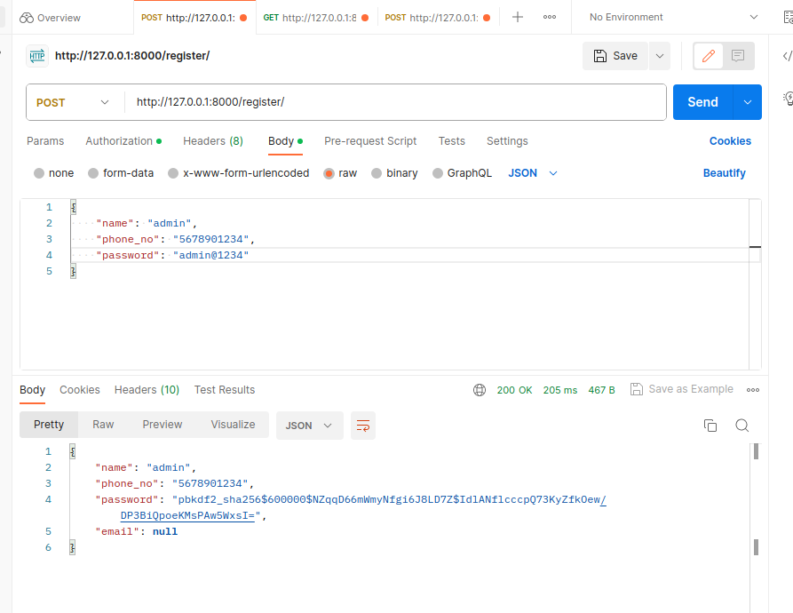
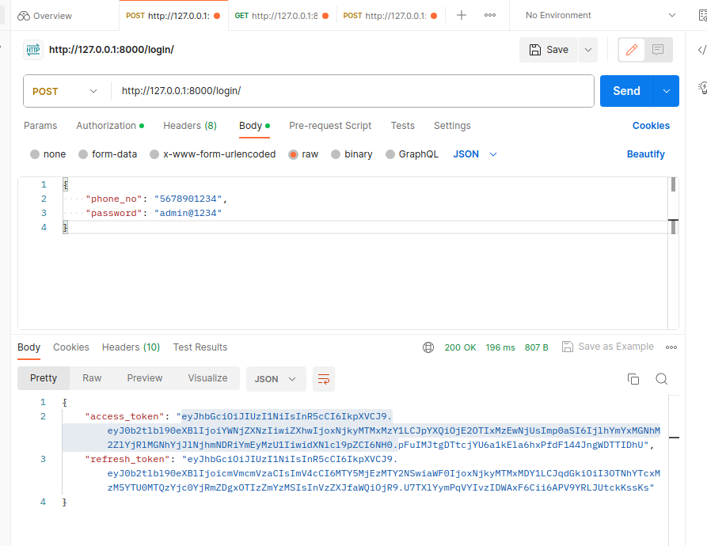
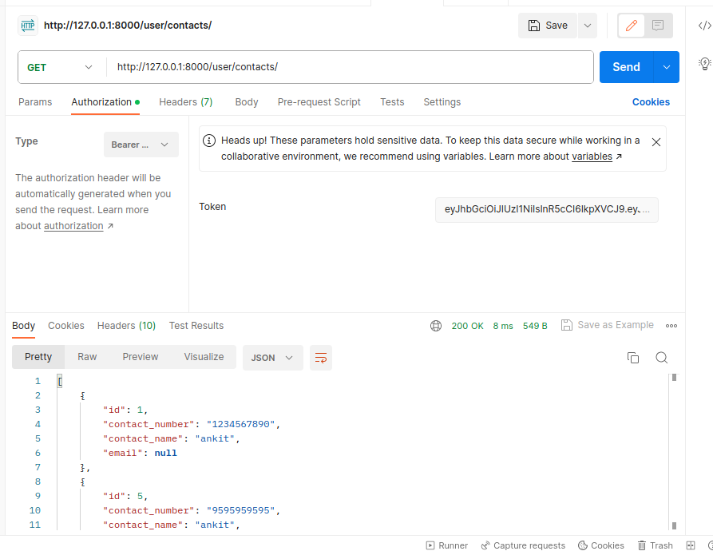
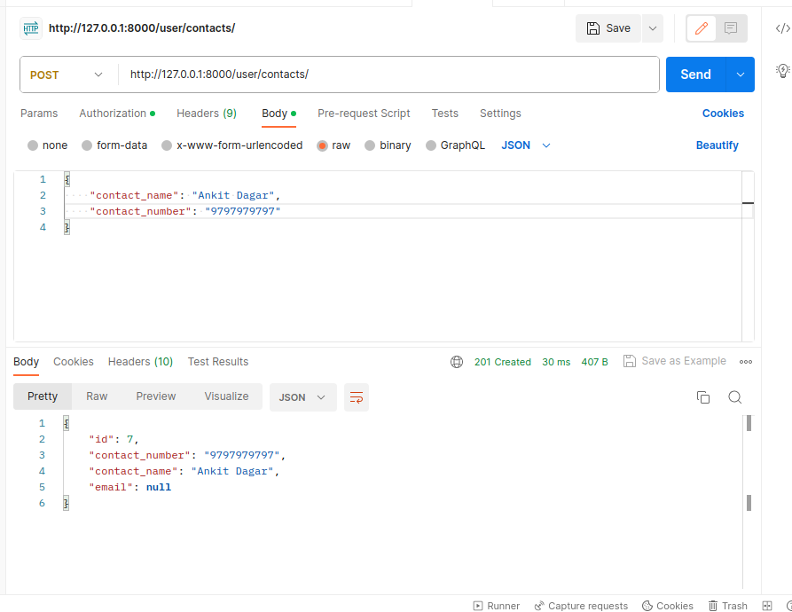
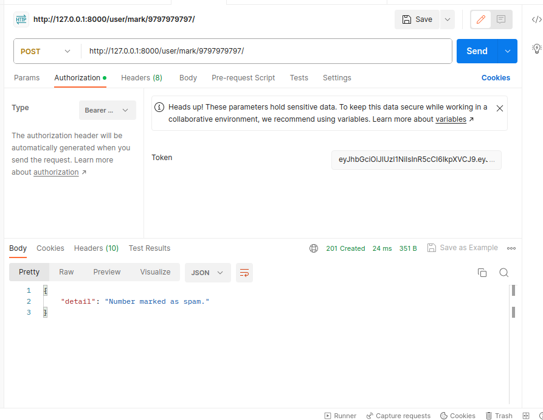
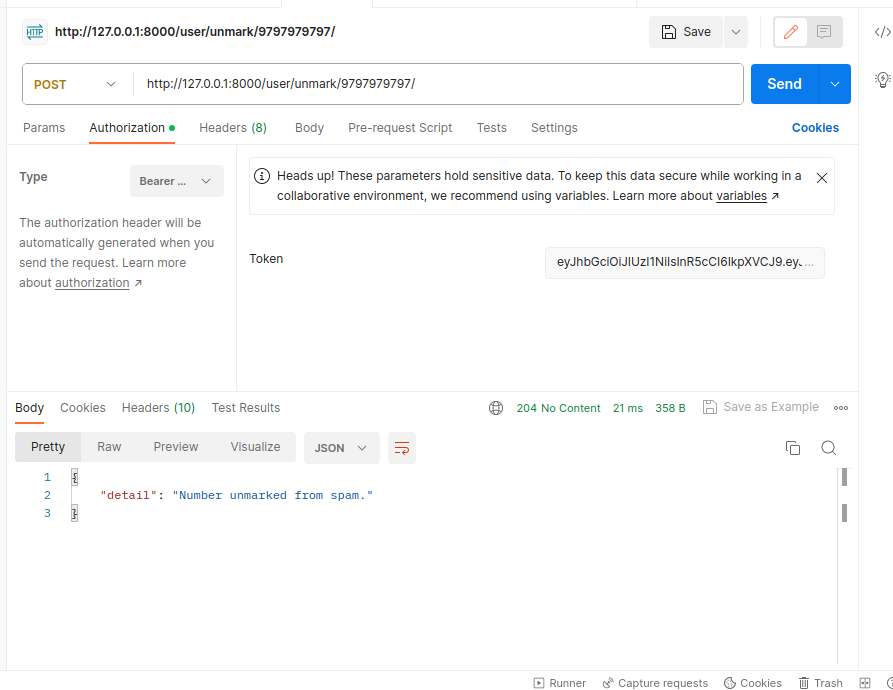
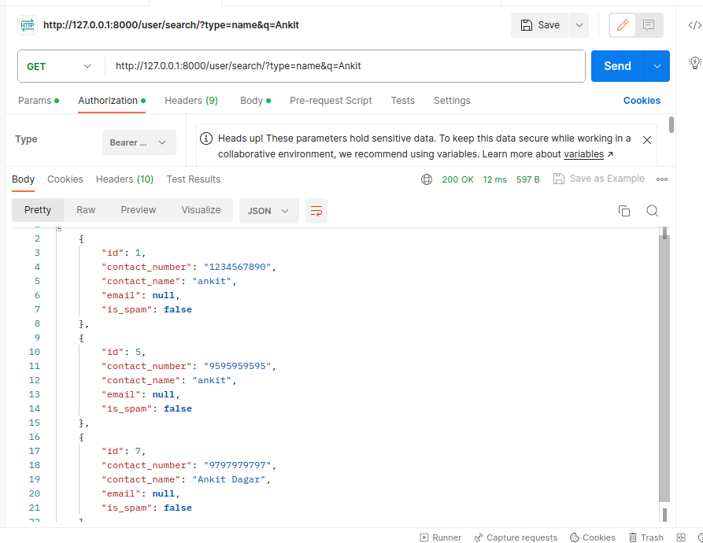
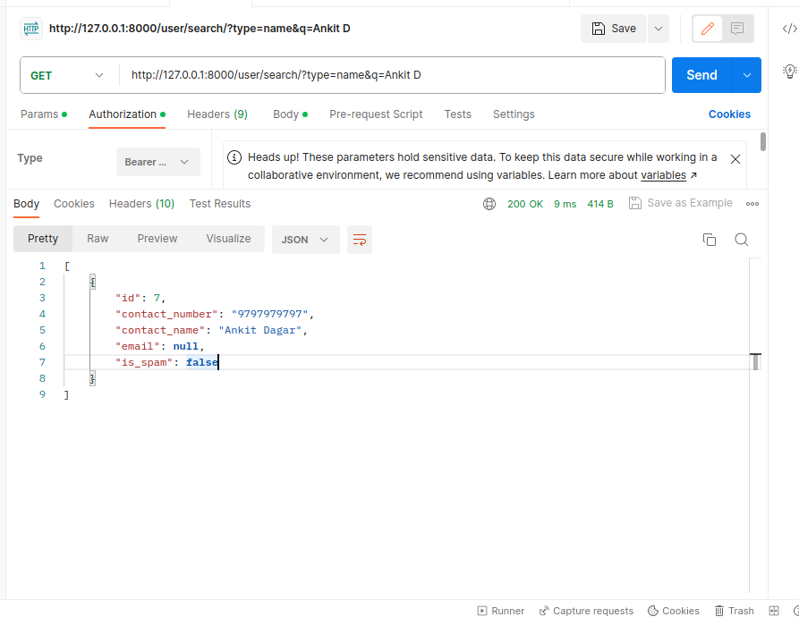
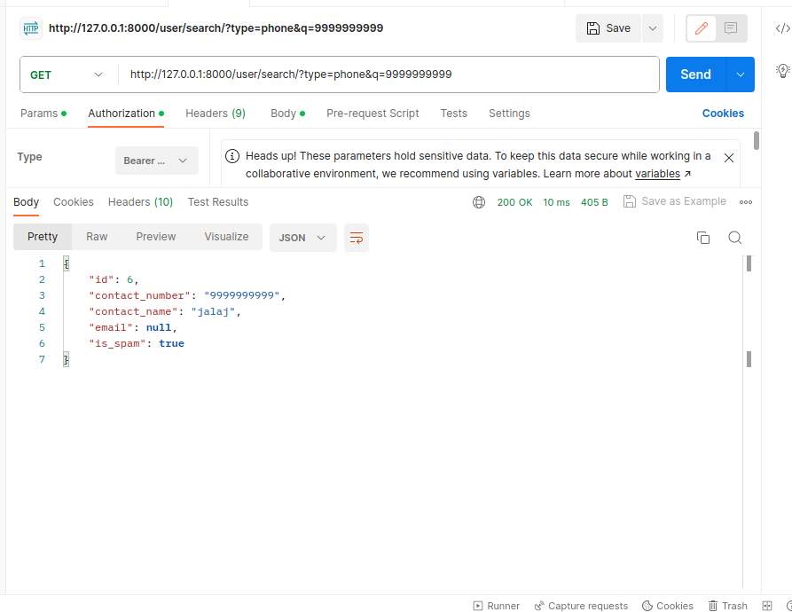

# API Task

## API functionalities

**Note**: Authorization header required for all operations

-   Register/Create Account
-   Login
-   CRUD operations on contact
-   Mark number as spam
-   Search contact by name
-   Search contact by phone number

## Register Endpoint

## Login Endpoint

### Note- Please add / at the end of the endpoint

- Copy the access token which would be used for accessing the endpoints.

- Refresh token will be used to refresh the access token after it expires in 5 minutes.

## CRUD Endpoints for Contacts for logged in User

## Marking/Unmarking Number as SPAM

## Searching with Name query

## Searching with phone number query 

